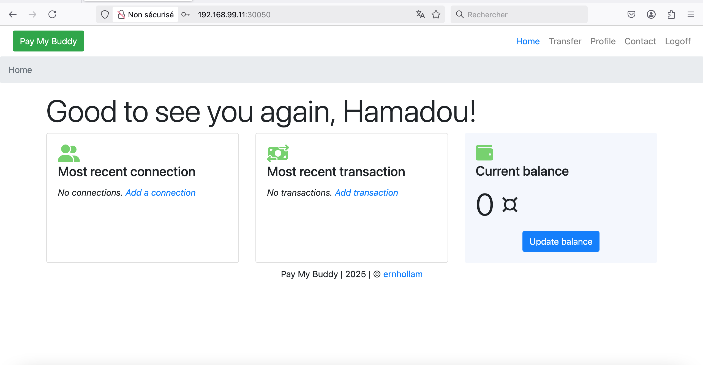
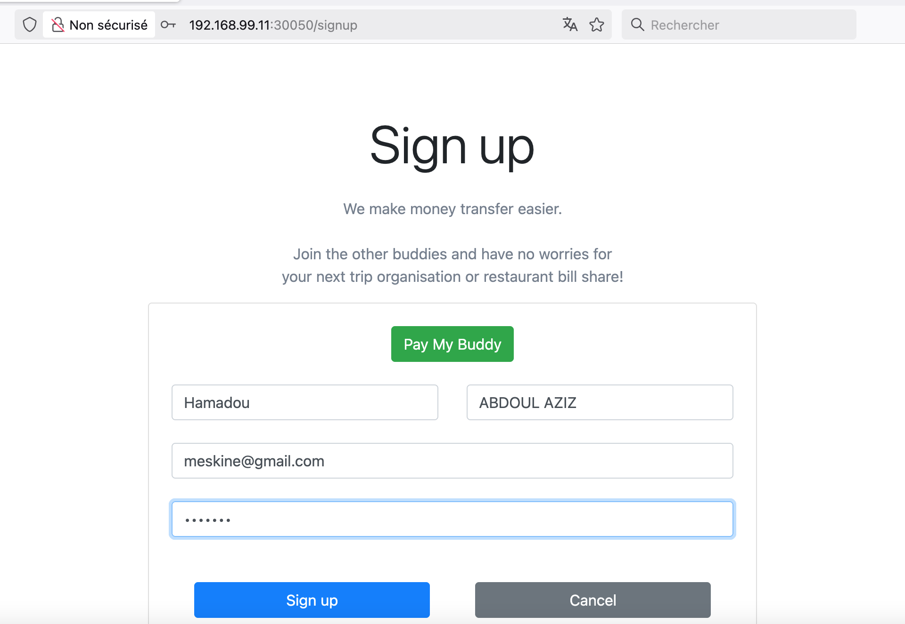

# Déployez PayMyBuddy à l’aide de manifests
     
## Contexte

Il s'agit de déployer l'application SpringBoot PayMyBuddy à l'aide de manifests yaml 

le code source se trouve la https://github.com/OlivierKouokam/PayMyBuddy/ 

## Realisation 

nous avons donc besoin d'executer  dans une environnement docker le Dockerfile et mettre l'image dans notre repository 

```
Docker build -t <pseudo>/paymybuddy .
```
sur notre cluster 

nous aurons besoin de créer un namespace, un secret et une configmap 
```
kubectl create namespace paymybuddy
kubectl create secret generic backend-user --from-literal=db-password='xxxx' -n paymybuddy 
k create configmap data-config --from-file=./database/create.sql -n paymybuddy
```
une fois réalisé nous pouvons donc lancer les differents manifests pour demarrer nos deployments 

initialisation de la BDD mysql 

```
k exec -n paymybuddy mysql-deployment-57459dc854-5hcj8 -it -- /bin/bash
mysql -u root -p  < /tmp/source/create.sql
```
## fonctionnement
```
vagrant@controlplane:~/paymybuddy_kub$ k get pod -n paymybuddy 
NAME                                READY   STATUS        RESTARTS   AGE
mysql-deployment-57459dc854-5hcj8   1/1     Terminating   0          165m
mysql-deployment-69cbb78c47-rmvks   1/1     Running       0          8s
pdy-deployment-8666849896-gxt8d     1/1     Running       0          52m
pdy-deployment-8666849896-qvp7m     1/1     Running       0          52m


vagrant@controlplane:~/paymybuddy_kub$ k get svc -n paymybuddy 
NAME            TYPE        CLUSTER-IP      EXTERNAL-IP   PORT(S)          AGE
mysql-pdy-svc   ClusterIP   172.17.20.128   <none>        3306/TCP         20h
pdy-service     NodePort    172.17.37.227   <none>        8080:30050/TCP   20h
```

 
 
